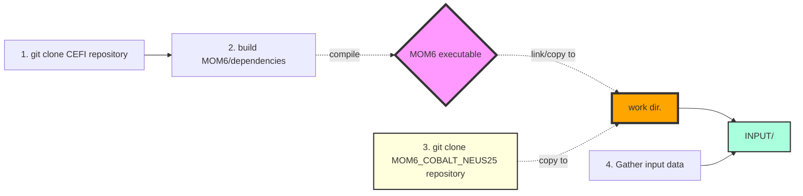
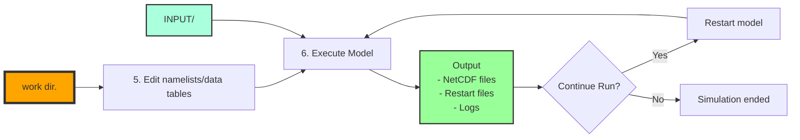

# MOM6-COBALT-NEUS25v1.0

**A High-Resolution Coupled Physical-Biogeochemical Model of the Northeastern US Continental Shelf**

## Overview

Regional configuration for the Northeast US shelf (30-50°N, 80-60°W) at ~1/25° horizontal resolution:
- **Ocean Model**: MOM6 with 75 vertical levels
- **Biogeochemistry**: COBALT with 33+ tracers (nutrients, carbon, plankton)
- **Sea Ice**: SIS2 dynamic-thermodynamic model
- **Period**: 1993-2019 (extensible)

This guide walks through setting up and running the MOM6-COBALT regional ocean-biogeochemistry model for the Northeast US continental shelf.

## Prerequisites

- Linux/Unix with MPI, Fortran compiler, NetCDF libraries (check compilation guide below)
- HPC is likely required

## Workflow Overview

### Setup phase


### Run Phase


Each step is documented below.

## Setup Process

### Step 1: git clone CEFI repository

```bash
git clone --recursive https://github.com/NOAA-GFDL/CEFI-regional-MOM6
cd CEFI-regional-MOM6
git checkout 214d998fba1776261df4af250d17663c272aa218
git submodule update --recursive
```

### Step 2: build MOM6/dependencies

Compile MOM6 for your system. This step is system-specific and produces the `MOM6` executable. The executable can be built once and be used for different experiments.

- [Compilation Guide](docs/compilation.md) 
- [GFDL Instructions](https://github.com/NOAA-GFDL/MOM6-examples/wiki)

### Step 3: git clone MOM6_COBALT_NEUS25 repository


```bash
cd /your/directory/of/choice
git clone https://github.com/dksasaki/MOM6_COBALT_NEUS25.git
cp -r MOM6_COBALT_NEUS25/exps/NEUS25.COBALT /your/work/dir/
cd /your/work/dir/NEUS25.COBALT/
ln -s /path/to/compiled/MOM6COBALT .
```


### Step 4: Gather input data

Place in the `/your/work/dir/NEUS25.COBALT/INPUT/:

- Static: Grid, IC, masks, tides, others → [Download from Zenodo]
- Forcing: ERA5, GLORYS, GloFAS, nudging files → Generate with tools

- [Input Files Guide](docs/input_files.md)
- [Preprocessing Tools](../tools/mom6_neus25_utils/README.md)

### Step 5: Edit Configuration

#### Essential Files (must edit) :

In `NEUS25.COBALT` dir.:

- `input.nml` - Set coupling configurations
- `configs/MOM_input` - Tune physics parameters
- `configs/MOM_override` - Override physics parameters (need to edit MOM_override.template)
- `configs/MOM_layout` - Grid layout for parallelization (parallization is configured here)
- `data_table` - Update paths to your input files (need to edit data_table.template)
- `field_table` - Configure boundary files and COBALT parameters
- `diag_table` - Configure output variables


[Configuration Guide](docs/configuration.md)

### Step 6: Execute Model

Run the model using one of these approaches:

**Test run** (interactive):
```bash
mpiexec -np 120 ./MOM6
 ```

**Production run** (HPC/SLURM):
```bash
sbatch --ntasks=120 mom.sub.x
``` 

The model will produce:
- NetCDF diagnostic files (as specified in `diag_table`)
- Restart files in `RESTART/` directory
- Log files for debugging

[Running Guide](docs/running.md)

## Quick Checklist

Before executing, verify:

- [ ] MOM6 executable is compiled and linked
- [ ] All files listed in `data_table` exist in `INPUT/`
- [ ] `configs/MOM_layout` matches your processor count
- [ ] `input.nml` has correct start date and duration
- [ ] Sufficient disk space for outputs (~5GB per simulated year)
