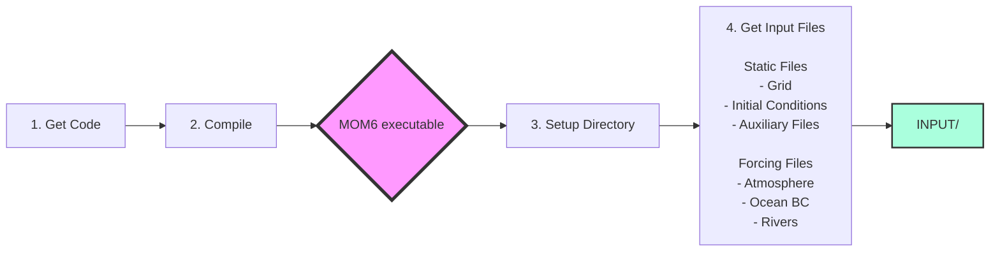
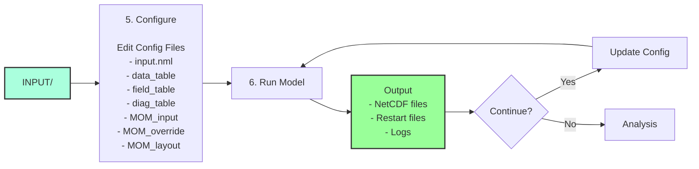

# NEUS25-MOM6-COBALT Setup Guide

## Overview

This guide walks through setting up and running the MOM6-COBALT regional ocean-biogeochemistry model for the Northeast US continental shelf.

## Prerequisites

- Linux/Unix environment with MPI
- Fortran compiler (Intel or GNU)
- NetCDF libraries
- ~2TB storage for inputs, ~5TB for outputs


## Workflow Overview

### Setup Phase


### Run Phase


## Setup Process

### Step 1: Get the Code

```bash
git clone --recursive https://github.com/NOAA-GFDL/CEFI-regional-MOM6
cd CEFI-regional-MOM6
git checkout 214d998fba1776261df4af250d17663c272aa218
git submodule update --recursive
```

### Step 2: Compile MOM6

Build the executable for your system. This step is system-specific and produces the `MOM6` executable.

📖 **[Compilation Guide](docs/compilation.md)** - Detailed build instructions  
🔗 **[GFDL Instructions](https://github.com/NOAA-GFDL/MOM6/wiki/Getting-Started)** - Official MOM6 build docs

### Step 3: Prepare Your Working Directory

```bash
# Copy the NEUS25 configuration
cp -r exps/NEUS25.COBALT /your/work/dir/

# Navigate to your working directory
cd /your/work/dir/NEUS25.COBALT/

# Link the compiled executable
ln -s /path/to/compiled/MOM6 .
```

Directory structure after setup:
```
NEUS25.COBALT/
├── MOM6 → (executable)
├── INPUT/              # Will contain forcing files
├── configs/            # Configuration files
├── input.nml          # Main control file
├── data_table         # Forcing file paths
├── diag_table         # Output configuration
└── field_table        # Tracer setup
```

### Step 4: Obtain Input Files

1. **Static files** (grid, initial conditions)
   - Download from Zenodo: [DOI]
   - Place in `INPUT/` directory

2. **Time-varying forcing** (atmosphere, ocean, rivers)
   - Generate using preprocessing tools
   - Or download pre-processed files from [location]

📖 **[Input Files Guide](docs/input_files.md)** - Complete list and descriptions  
🔧 **[Preprocessing Tools](../tools/mom6_neus25_utils/README.md)** - Generate forcing from raw data

### Step 5: Configure Your Run

Configuration involves editing several files:


Essential configurations:

1. **Set simulation dates** in `input.nml`:
```fortran
&coupler_nml
  current_date = 1993,1,1,0,0,0  ! Start date
  months = 3                      ! Run duration
/
```

2. **Set processor layout**: Copy appropriate layout file
```bash
cp configs/MOM_layout.120 configs/MOM_layout  # For 120 cores
```

3. **Update forcing paths** in `data_table` to point to your INPUT files

📖 **[Configuration Guide](docs/configuration.md)** - All configuration options explained

### Step 6: Run the Model

Test run (interactive):
```bash
mpiexec -np 120 ./MOM6
```

Production run (HPC/SLURM):
```bash
sbatch --ntasks=120 mom.sub.x
```


📖 **[Running Guide](docs/running.md)** - Run options, restart management, performance tips

## Quick Checklist

Before running, verify:

- [ ] MOM6 executable is compiled and linked
- [ ] All files listed in `data_table` exist in `INPUT/`
- [ ] `configs/MOM_layout` matches your processor count
- [ ] `input.nml` has correct start date
- [ ] Sufficient disk space for outputs (~5GB per simulated year)

## Output Files

The model produces:
- **NetCDF diagnostics** in current directory (*.nc files)
- **Restart files** in `RESTART/` for continuing runs
- **Log files** for debugging

📖 **[Output Guide](docs/outputs.md)** - File formats, variables, post-processing

## Getting Help

- **Common issues**: See [Troubleshooting Guide](docs/troubleshooting.md)
- **Configuration questions**: Check generated `MOM_parameter_doc.*` files
- **Model science**: [MOM6 Documentation](https://mom6.readthedocs.io)
- **This configuration**: [Open an issue](https://github.com/your-repo/issues)

## Next Steps

- For long simulations: See [SLURM Guide](docs/slurm_guide.md)
- For custom domains: See [Grid Generation](docs/grid_generation.md)
- For analysis: See [Post-processing Tools](docs/analysis.md)