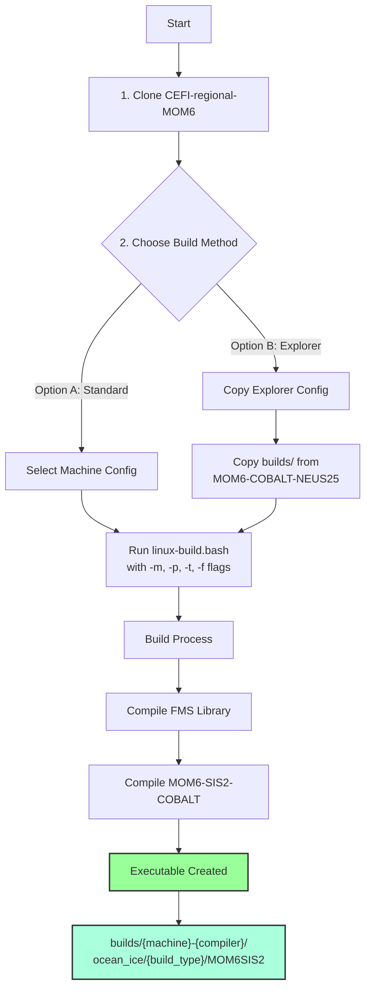

# MOM6-COBALT-NEUS25 Compilation Guide

## Overview

This guide covers compiling the CEFI-regional-MOM6 system with MOM6, SIS2, and COBALT biogeochemistry for regional ocean modeling with open boundary conditions.

## Prerequisites

- Fortran compiler (Intel or GNU)
- MPI implementation
- NetCDF (C and Fortran)
- Git with submodules
- For Explorer: See `install_libraries.sh` for dependency installation

## Workflow overview




### Step 1: Clone Repository

Clone the CEFI-regional-MOM6 repository with all submodules at a directory of your choice:

```bash
git clone https://github.com/NOAA-GFDL/CEFI-regional-MOM6.git --recursive
cd CEFI-regional-MOM6
```

For the specific tested version:
```bash
git checkout 214d998fba1776261df4af250d17663c272aa218
git submodule update --recursive
```

### Step 2: Build the Model


#### Build Types
- **repro**: Reproducible (optimized, bit-reproducible)
- **debug**: Debug mode (with checks)
- **prod**: Production (maximum optimization)

Replace `repro` in paths and REPRO=1 flag accordingly.

#### Option A: Using CEFI's Build Script

In `CEFI-regional-MOM6`, you can compile using the provided build script:
```bash
cd /path/to/CEFI-regional-MOM6/builds
./linux-build.bash -m gaea -p intel19 -t prod -f mom6sis2
```

**Note**: The `-m` flag selects the machine directory (e.g., `gaea/`), `-p` selects the compiler environment (e.g., `intel19.env` and `intel19.mk`), `-t` sets build type (prod/repro/debug), and `-f` specifies the target (mom6sis2). You'll need to set up both for your environment.

#### Option B: For Northeastern Explorer (HPC)

Explorer users should use the specific build configuration from your MOM6-COBALT-NEUS25 repository:
```bash
# work interactively into a node (cascadelake is intel architecture)
srun --partition=short --constraint=cascadelake --mem=16G --ntasks=8 --pty /bin/bash


# Navigate to the Explorer-specific build directory
cp -r /path/to/MOM6-COBALT-NEUS25/exps/NEUS25.COBALT/builds/explorer /path/to/CEFI-regional-MOM6/builds/explorer

cd /path/to/CEFI-regional-MOM6/builds
./linux-build.bash -m explorer -p intel

```

**Note**: The Explorer setup includes `intel.env` and `intel.mk` specifically configured for Explorer's Intel 2025.0.4 compilers and InfiniBand.

#### Executable

After compiling (following **option A**), the executable should be located at:
`/path/to/CEFI-regional-MOM6/builds/build/{machine}-{compiler}/ocean_ice/{build_type}/MOM6SIS2`

For example:
- Gaea with Intel 19: `builds/build/gaea-intel19/ocean_ice/prod/MOM6SIS2`
- Explorer with Intel: `builds/build/explorer_intel-intel/ocean_ice/prod/MOM6SIS2`

