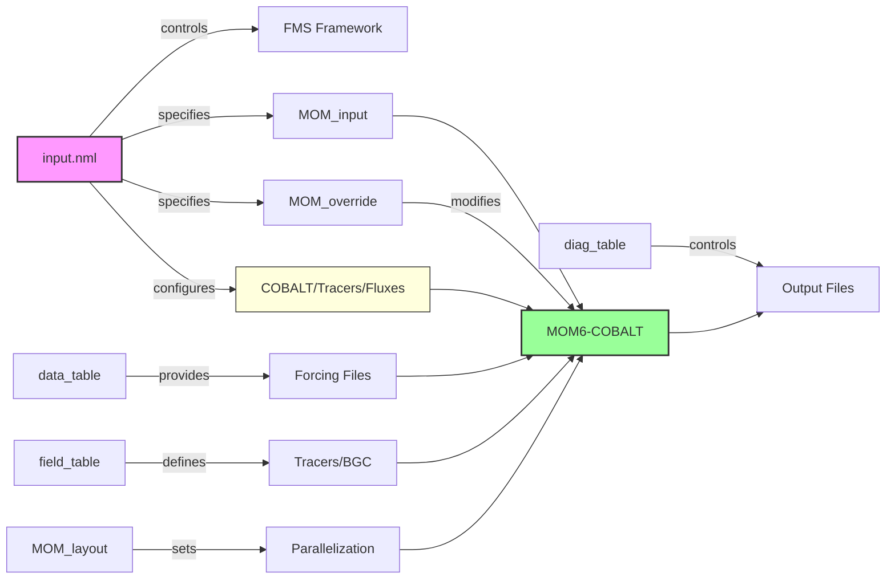

# MOM6-COBALT-NEUS25v1.0 Configuration Files Guide

## Overview

MOM6 uses several configuration files to control model parameters, input/output, and runtime behavior. Each file has a specific purpose and syntax. This is a general and non-comprehensive overview. All files below are specific to the github hash comit of CEFI and may not be compatible with more up-to-date versions of CEFI and MOM6.

## Workflow overview



## Core Configuration Files

### 1. **input.nml**
**Purpose**: FMS framework control and model coupling


The input.nml file contains FMS (Flexible Modeling System) parameters that control the overall model execution. It includes a small set of logistical parameters that specify which MOM6 parameter files to read and how long to run the model.
Key namelists:

- MOM_input_nml: MOM6-specific initialization parameters including grid, configuration file paths, input paths, and whether to perform a cold start or restart.
- SIS_input_nml: similar MOM_input_nml, but for SIS
- cobalt_input_nml: similar MOM_input_nml, but for COBALT
- coupler_nml: controls model coupling and timing. Sets simulation start date, run duration, timesteps for each component (ocean, atmosphere, ice), and specifies which components are active.
- generic_tracer_nml: manages generic tracer modules that may be used with the coupler, such as COBALT and other packages.
- surface_flux_nml: specifies surface bulk formula options when not coupled to an atmospheric model.

### 2. **MOM_input**
**Purpose**: Primary physics and numerics configuration  
**Format**: Key-value pairs with extensive inline documentation

```
! === module MOM_domains ===
NIGLOBAL = 360              ! Total number of i-points
NJGLOBAL = 180              ! Total number of j-points
NK = 75                     ! Number of vertical layers

! === module MOM_dynamics_split_RK2 ===
DT = 900.0                  ! Ocean dynamics timestep [s]
```

**Key features**:
- Controls ocean physics (mixing, advection, equation of state)
- Sets grid dimensions and resolution
- Configures numerical schemes

### 3. **MOM_override**
**Purpose**: Override or add parameters without editing MOM_input  
**Format**: Same as MOM_input but with `#override` prefix for existing parameters

```
#override DT = 600.0        ! Override existing parameter
KHTH = 10.0                 ! Add new parameter not in MOM_input
```

**Best practice**: Use for experiment-specific changes, keeping MOM_input as baseline

### 4. **MOM_layout**
**Purpose**: Domain decomposition for parallel execution (it excludes land-points from being included in parallel applications)  
**Format**: Simple key-value pairs


```
MASKTABLE = "mask_table.120.16x10"  ! Processor mask file
LAYOUT = 16,10                       ! X,Y processor distribution
IO_LAYOUT = 1,1                      ! I/O processor layout
```

`mask_table.120.16x10` should be placed in `/INPUT`.

**Must match**: Number of MPI tasks (16 × 10 = 160 in example, but mask may exclude some)

In order to build mask_table files, use the check_mask tool from [FRE-NCtools](https://github.com/NOAA-GFDL/FRE-NCtools) (`FRE-NCtools/src/check-mask`).

**Note**: avoid using mask_table at early stages of your model configuration.


### 5. **data_table**
**Purpose**: Maps external forcing files to model variables  
**Format**: Space-delimited fields per line

```
"gridname" "fieldname_code" "fieldname_file" "file_name" "interp_method" "factor"
```

Example:
```
"ATM" "u_bot" "u_ref" "./INPUT/ERA5_u_ref_1993_padded.nc" "bilinear" 1.0
"ATM" "t_bot" "T_ref" "./INPUT/ERA5_T_ref_1993_padded.nc" "bilinear" 1.0
"ICE" "sst_obs" "sst" "./INPUT/sst_monthly.nc" "bilinear" 1.0
```

**Components**: ATM (atmosphere), ICE (sea ice), OCN (ocean), LND (land)  
**Interpolation**: bilinear, bicubic, conservative, or none  
**Factor**: Multiplier for unit conversion

**Documentation**: [Read the docs!](https://mom6.readthedocs.io/en/main/forcing.html)


### 6. **field_table**
**Purpose**: Define tracers, their initialization and model coefficients


### 7. **diag_table**

**Purpose**: Control diagnostic output (what, when, how)  
**Format**: Three sections - Header, Files, Fields

```
"Experiment Title"
1993 1 1 0 0 0              ! Base date for time axis

# === FILE DEFINITIONS ===
"file_name",  output_freq,  "output_freq_units",  file_format,  "time_axis_units",  "time_axis_name"


# === FIELD DEFINITIONS ===
"module_name",  "field_name",  "output_name",  "file_name",  "time_sampling",  "reduction_method",  "regional_section",  packing

```

**documentation** [Read the docs!](https://mom6.readthedocs.io/en/main/api/generated/pages/Diagnostics.html)


## File Hierarchy and Precedence

```
1. MOM_input     (base configuration)
    ↓
2. MOM_override  (experiment-specific changes)
    ↓
3. Runtime       (command-line overrides if any)
```

## Common Workflows

### Starting a New Experiment
1. Edit input.nml
2. Copy existing `MOM_input` as baseline
3. Create `MOM_override` for your changes
4. Update `data_table` with correct file paths/years
5. Adjust `diag_table` for desired output
6. Set `MOM_layout` to match CPU allocation

### Changing Output Variables
Edit `diag_table`:
- Add new file definition for different frequency
- Add field entries for each variable
- Restart not required

### Modifying Physics
Edit `MOM_override`, for instance:
```
#override KHTH = 100.0       ! Change thickness diffusivity
#override USE_GM = .true.     ! Enable GM parameterization
```

### Adjusting for Different Years
1. Update `input.nml` for start date
2. Update `data_table` filenames with correct years
3. Copy and edit `data_table.template` → `data_table`

## Generated Documentation

After first run, MOM6 creates:
- `MOM_parameter_doc.all` - All parameters with values used
- `MOM_parameter_doc.short` - Non-default parameters only
- `MOM_parameter_doc.layout` - Domain decomposition details

Use these to understand what parameters were actually used and their defaults.
